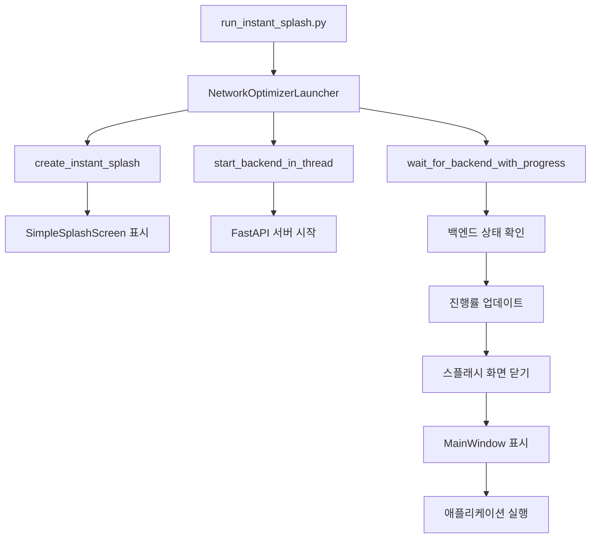

# 🌐 Network Optimizer v3.1.0 - 프로젝트 구조 가이드

## 📋 개요

Network Optimizer는 **모듈화된 구조**로 설계되어 유지보수성과 확장성을 높였습니다. v3.1.0에서는 핵심 기능들을 `core` 모듈로 분리하여 더욱 체계적인 구조를 갖추었습니다.

## 🏗️ 아키텍처 개요

```
┌─────────────────────────────────────────────────────────────┐
│                    Network Optimizer v3.1.0                │
├─────────────────────────────────────────────────────────────┤
│  🚀 Entry Point                                            │
│  └── run_instant_splash.py                                 │
├─────────────────────────────────────────────────────────────┤
│  🧠 Core Module                                            │
│  ├── launcher.py (애플리케이션 런처)                        │
│  └── splash.py (스플래시 화면)                             │
├─────────────────────────────────────────────────────────────┤
│  🔧 Backend (FastAPI)                                      │
│  ├── main.py (API 서버)                                    │
│  ├── routers/ (API 엔드포인트)                              │
│  ├── services/ (비즈니스 로직)                              │
│  └── schemas/ (데이터 모델)                                 │
├─────────────────────────────────────────────────────────────┤
│  🎨 Frontend (PyQt5)                                       │
│  ├── pyqt_app.py (메인 앱)                                 │
│  ├── pyqt_window.py (UI 윈도우)                            │
│  ├── pyqt_charts.py (차트 생성)                            │
│  └── api_client.py (API 통신)                              │
└─────────────────────────────────────────────────────────────┘
```

## 📁 상세 구조

### 🚀 Entry Point
- **`run_instant_splash.py`**: 메인 실행 스크립트
  - 간단한 진입점으로 `core.launcher`를 사용
  - 에러 처리 및 예외 상황 관리

### 🧠 Core Module
- **`core/launcher.py`**: 애플리케이션 런처
  - 경로 관리 (PyInstaller/개발 환경 대응)
  - 포트 정리 및 백엔드 서버 시작
  - 스플래시 화면과 백엔드 상태 연동
  - 메인 애플리케이션 실행

- **`core/splash.py`**: 스플래시 화면 모듈
  - `SimpleSplashScreen`: 메인 스플래시 화면 클래스
  - `LoadingWorker`: 백그라운드 로딩 작업 (선택적 사용)
  - 애니메이션 및 진행률 표시

### 🔧 Backend (FastAPI)
- **`main.py`**: FastAPI 메인 서버
  - CORS 설정 및 라우터 등록
  - 헬스 체크 엔드포인트

- **`routers/`**: API 엔드포인트
  - `dns_measure.py`: DNS 성능 측정
  - `dns_apply.py`: DNS 서버 설정 적용
  - `dns_reset.py`: DNS 설정 리셋
  - `ip_measure.py`: IP 응답 속도 측정

- **`services/`**: 비즈니스 로직
  - `dns_service.py`: DNS 관련 비즈니스 로직

- **`schemas/`**: 데이터 모델
  - `dns_models.py`: Pydantic 모델 정의

- **`dns_servers.py`**: DNS 서버 목록 및 설정

### 🎨 Frontend (PyQt5)
- **`pyqt_app.py`**: PyQt5 메인 애플리케이션
- **`pyqt_window.py`**: 메인 윈도우 UI
- **`pyqt_charts.py`**: Matplotlib 차트 생성
- **`api_client.py`**: 백엔드 API 통신

## 🔄 실행 흐름



## ✨ 모듈화의 장점

### 1. **관심사 분리**
- 각 모듈이 명확한 책임을 가짐
- 코드의 가독성과 유지보수성 향상

### 2. **재사용성**
- `core` 모듈의 기능들을 다른 프로젝트에서 재사용 가능
- 스플래시 화면을 독립적으로 사용 가능

### 3. **테스트 용이성**
- 각 모듈을 독립적으로 테스트 가능
- Mock 객체 사용이 쉬움

### 4. **확장성**
- 새로운 기능 추가 시 적절한 모듈에 배치
- 기존 코드에 영향을 최소화

## 🛠️ 개발 가이드

### 새로운 기능 추가
1. **백엔드**: `routers/`, `services/`, `schemas/`에 적절히 분산
2. **프론트엔드**: `frontend/`에 새로운 파일 추가
3. **핵심 기능**: `core/`에 추가 모듈 생성

### 코드 스타일
- **Python**: PEP 8 준수
- **타입 힌트**: 가능한 모든 곳에 타입 힌트 사용
- **문서화**: 모든 함수와 클래스에 docstring 추가

### 에러 처리
- `run_instant_splash.py`에서 전역 예외 처리
- 각 모듈에서 적절한 예외 처리
- 사용자에게 친화적인 에러 메시지

## 📦 빌드 및 배포

### PyInstaller 설정
- **`.spec` 파일들**: 각 플랫폼별 최적화된 설정
- **`core` 모듈 포함**: 모든 빌드에서 `core` 모듈 포함
- **데이터 파일**: 필요한 모든 파일들이 포함되도록 설정

### 플랫폼별 빌드
- **macOS**: `build_macos_v3_improved.sh`
- **Windows**: `build_windows_v3.bat`
- **Linux**: `build_linux_v3.sh`

## 🎯 향후 계획

### v3.2.0 예정 기능
- **설정 관리 모듈**: 사용자 설정을 관리하는 `core/config.py`
- **로그 모듈**: 통합 로깅 시스템
- **플러그인 시스템**: 확장 가능한 플러그인 아키텍처

### 성능 최적화
- **메모리 사용량 최적화**
- **시작 시간 단축**
- **응답 속도 개선**

---

**Network Optimizer 팀 v3.1.0** 🚀

*모듈화된 구조로 더욱 안정적이고 확장 가능한 애플리케이션을 제공합니다.*


